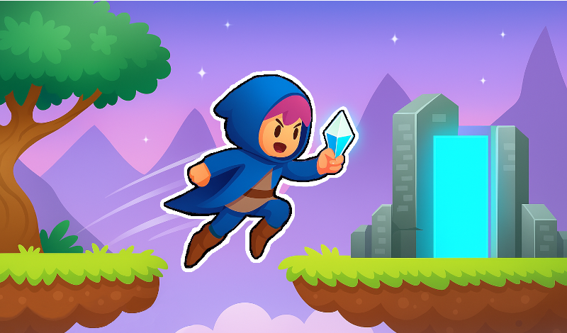

# Puzzle Platformer 2D for WebGL (PC, Mobile, Tablet) 

 

I independently developed a 2D puzzle platformer using Unity and C#, optimized for WebGL and playable on desktop, mobile, and tablets.

The game features 35 handcrafted levels, a tutorial, a save/load system, scoring, and localization (English, Russian, Turkish).

🔹 Reduced WebGL build size from 37MB to under 20MB  
🔹 Built a responsive UI with adaptive input (keyboard for desktop, touch controls for mobile and tablet)  
🔹 Integrated platform API: ads, cloud saves, analytics, leaderboards  
🔹 Implemented audio system with music and SFX  
🔹 Smooth performance across devices  

Live on Yandex Games with a stable WebGL build.  
Here’s a link to try it: [Floating Islands: Puzzle Platformer 2D](https://playhop.com/app/406455)

  
  
  
  

  
  
  

 

  

 

## My GameDev Projects 
• [Idle Arcade 3D](https://github.com/AlesandroDenisov/IdlePrototype) 
• [City Ytic](https://) 
• [Brave Diver](https://) 

 

<h3 align="center">Let’s connect and discuss how I can help bring your game to life!</h3>

 &nbsp; &nbsp;
 &nbsp; &nbsp;

